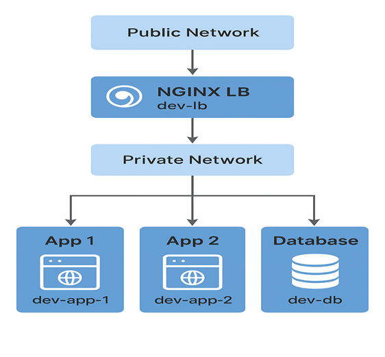
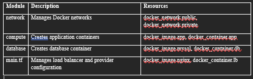
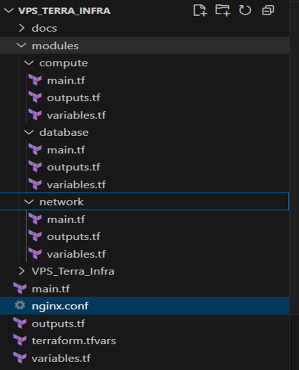
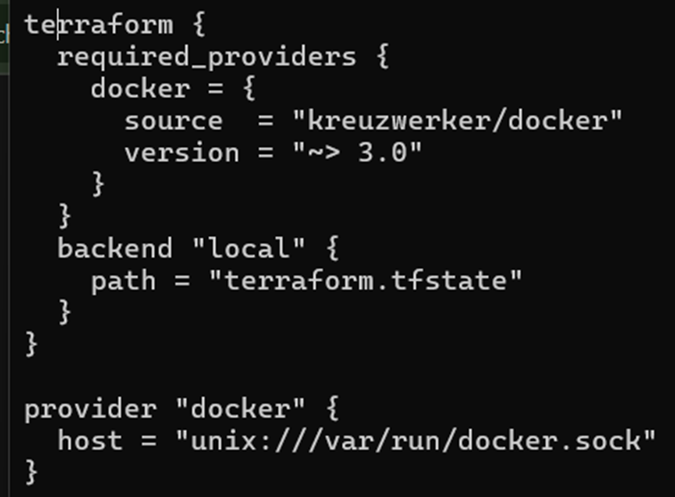
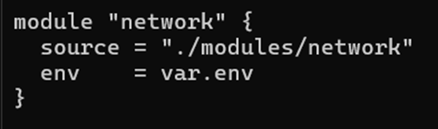
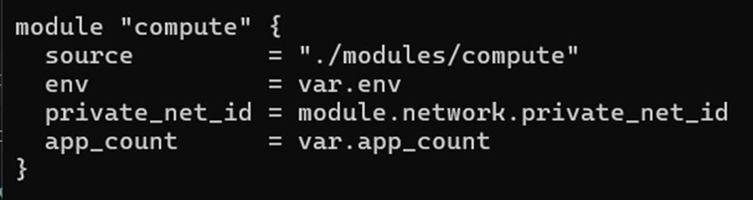
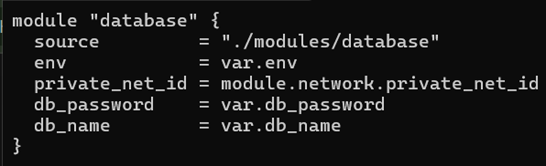
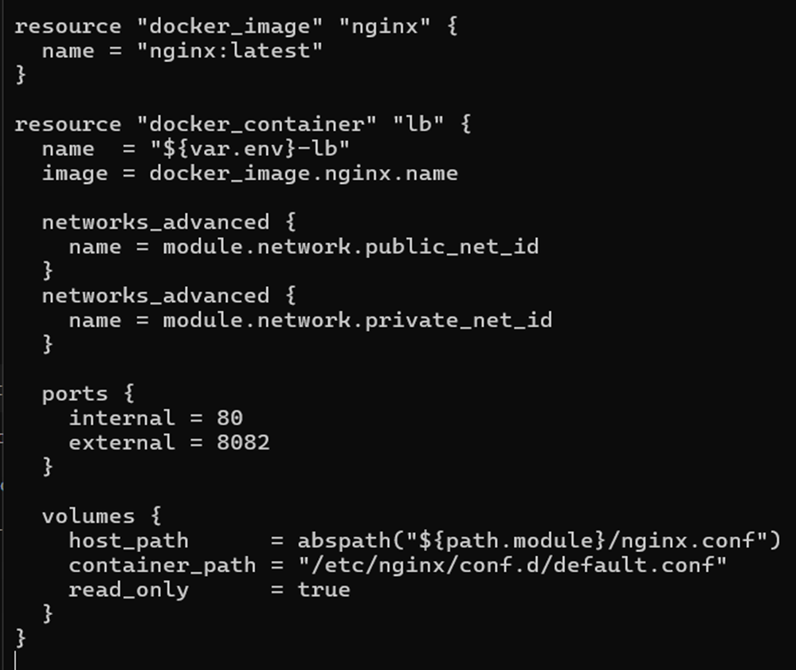
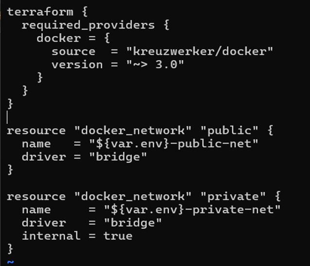

# Terraform Infrastructure Documentation on VPS Platform
## 1.	Project Overview
* This project deploys a multi-container environment using Terraform and Docker on a VPS. The architecture includes:
    * Load Balancer (LB): NGINX container to distribute traffic to backend app containers.
    * Application (App): Multiple HTTPD containers serving web apps.
    * Database (DB): MySQL container for persistent storage.
    * Network: Public and private Docker networks for container isolation and communication.

## 2.	Architecture Diagram

## 3.	Terraform Modules

## 4.	Key Terraform Concepts
* Providers: kreuzwerker/docker is used for Docker container management.
* Backend: Local backend (terraform.tfstate) stores state file on the VPS.
* Absolute Paths: Required for Docker volume mounts.
* Networks: Containers communicate using Docker networks (private_net_id and public_net_id).
* Outputs:
    * lb_access_url: URL to access the NGINX load balancer.
    * app_ips: IP addresses of app containers.
    * db_endpoint: Database connection endpoint.

## 5.	File Structure

## 6.	Root Configuration (main.tf)
<ins> Providers and Backend </ins>

    
   * Uses the Docker provider to manage Docker resources on your VPS.
   * Stores Terraform state locally (terraform.tfstate).

<ins>Modules</ins>

**Network Module**

> * Creates public and private Docker networks.
> * Output: public_net_id, private_net_id.

**Compute Module**

> * Deploys multiple app containers (httpd:latest) on private network.
> * Output: app_ips.

**Database Module**

> * Deploys MySQL container on private network.
> * Output: db_endpoint.

<ins>Load Balancer</ins>

> * Nginx container bridges public and private networks.
> * Uses nginx.conf to route traffic to app containers.
> * Exposes port 8082 on VPS.

## 7.	Modules Explained
> **a.	Network Module**
> > 