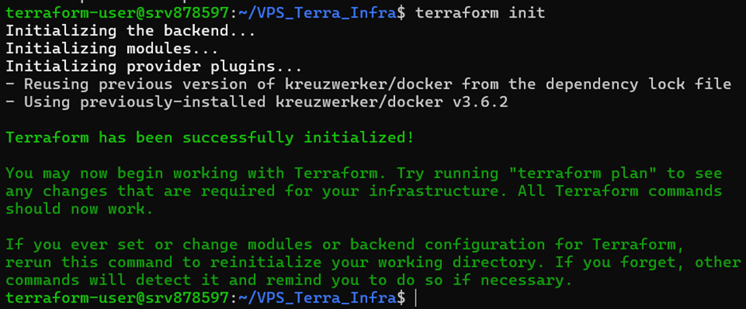
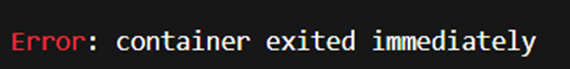
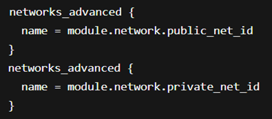

# Terraform Infrastructure Documentation on VPS Platform
## 1.	Project Overview
> * This project deploys a multi-container environment using Terraform and Docker on a VPS. The architecture includes:
>>    * Load Balancer (LB): NGINX container to distribute traffic to backend app containers.
>>    * Application (App): Multiple HTTPD containers serving web apps.
>>    * Database (DB): MySQL container for persistent storage.
>>    * Network: Public and private Docker networks for container isolation and communication.

## 2.	Architecture Diagram

> 

## 3.	Terraform Modules

> 

## 4.	Key Terraform Concepts
> * Providers: kreuzwerker/docker is used for Docker container management.
> * Backend: Local backend (terraform.tfstate) stores state file on the VPS.
> * Absolute Paths: Required for Docker volume mounts.
> * Networks: Containers communicate using Docker networks (private_net_id and public_net_id).
> * Outputs:
>>    * lb_access_url: URL to access the NGINX load balancer.
>>    * app_ips: IP addresses of app containers.
>>    * db_endpoint: Database connection endpoint.

## 5.	File Structure

> 

## 6.	Root Configuration (main.tf)
<ins> Providers and Backend </ins>

> 
>> * Uses the Docker provider to manage Docker resources on your VPS.
>> * Stores Terraform state locally (terraform.tfstate).

<ins>Modules</ins>

**Network Module**

> 
>> * Creates public and private Docker networks.
>> * Output: public_net_id, private_net_id.

**Compute Module**

> 
>> * Deploys multiple app containers (httpd:latest) on private network.
>> * Output: app_ips.

**Database Module**

> 
>> * Deploys MySQL container on private network.
>> * Output: db_endpoint.

<ins>Load Balancer</ins>

> 
>> * Nginx container bridges public and private networks.
>> * Uses nginx.conf to route traffic to app containers.
>> * Exposes port 8082 on VPS.

## 7.	Modules Explained
> **a.	Network Module**
>> 
>>> * public network allows external access.
>>> * private network is internal only for apps and DB communication.

> **b.	Compute Module**
>> 
>>> * Deploys var.app_count HTTP app containers. 
>>> * Connected to the private network.
>>> * count = var.app_count  -> number of app containers.
>>> * Outputs IPs for LB to use.

> **c.	Database Module**
>> 
>>> * MySQL container on private network.
>>> * Environment variables configure DB credentials.
>>> * Exposes external port 3307 for optional access.

## 8.	Outputs
> * lb_access_url → Access load balancer via VPS public IP.
> * db_endpoint → DB IP:port for internal or external access.
> * pp_ips → List of all app container IPs in private network.

## 9.	Nginx Config
> 
>> * Routes traffic from public network to private app containers.

## 10.	Step-by-Step Workflow
> **a.	Initialize Terraform**
>> 
>>> * Downloads Docker provider (kreuzwerker/docker).
>>> * Prepares local backend (terraform.tfstate).

> **b.	Check What Will Happen**
>> 
>>> Terraform simulates what it will create:
>>>> * Networks → public & private
>>>> * App containers → 2 by default
>>>> * Database container
>>>> * Nginx load balancer
>>> It’s like drawing a blueprint before building.

> **c.	Apply Terraform**
>> $ terraform apply
>> 
>>> * Terraform actually creates the resources.

> **d.	Check Outputs**
>> 
>>> * Open browser → http://194.164.151.129:8082 → traffic is routed to one of the app containers.
>>> * Use mysql -h 172.23.0.4 -P 3306 -u root -p → connect to DB (inside private network).
>>>> 

## **Verify the Containers status:**
> 

> 

## 11.	Buggs  and Solution
> **A.	Terraform Provider Issue**
>> Problem:
>>> * When running terraform init, you got:
>>>> 

>> Cause:
>>> * Terraform was trying to use the wrong provider (hashicorp/docker) which does not exist in the registry.
>>> * Your modules were implicitly depending on hashicorp/docker.

>> Solution:
>>> * Explicitly specify the correct provider in terraform block:
>>>> 

> **B.	Unsupported Arguments in docker_container**
>> Problem:
>>> * Running terraform plan gave errors:
>>> 

>> Cause:
>>> * kreuzwerker/docker provider v3+ does not use cpu_count.
>>> * volumes { type, source, target } was the old syntax from hashicorp/docker.

>> Solution:
>>> * Use the current provider syntax:
>>>> 
>>> * Remove unsupported fields (cpu_count, type, source, target).

> **C.	Path Issue for Volume Mount**
>> Problem:
>>> 

>> Cause:
>>> * Docker provider requires absolute paths for host volume mounts.

>> Solution:
>>> * Use abspath():
>>>> 

> **D.	LB Container Exited Immediately**
>> Problem:
>>> * Even after terraform apply, LB container kept crashing.
>>>> 

>> Cause:
>>> * Your nginx.conf included:
>>>> 
>>> * When mounted to /etc/nginx/conf.d/default.conf, the extra http {} caused nested http blocks, which NGINX rejects.
>>> * Also, LB might not have been on the same network as app containers, so dev-app-1/dev-app-2 could not be resolved.

>> Solution:
>>> * •	Correct nginx.conf:
>>>> 
>>> * Mount to /etc/nginx/conf.d/default.conf.
>>> * Ensure LB is connected to the same private network as app containers.

> **E.	App Not Accessible in Browser**
>> Problem:
>>> * Containers were running, but visiting http:// 194.164.151.129:8082 returned nothing.

>> Cause:
>>> * NGINX LB was failing to start (due to nginx.conf errors).
>>> * App containers were on private network, LB was not able to resolve them.

>> Solution:
>>> * Fixed nginx.conf as above.
>>> * LB connected to both private and public networks:
>>>> 
>>> * Exposed LB port 8082 to VPS.

